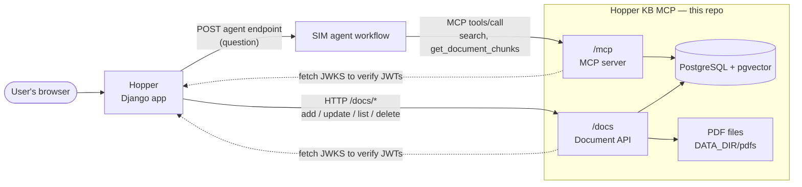
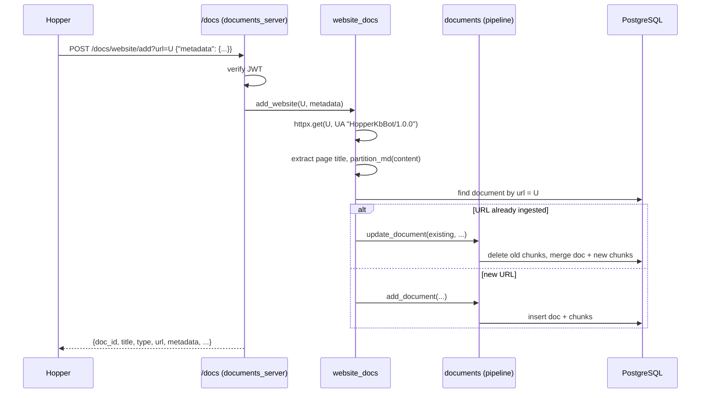
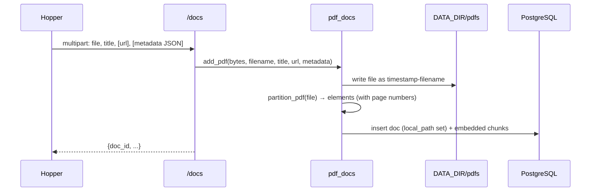
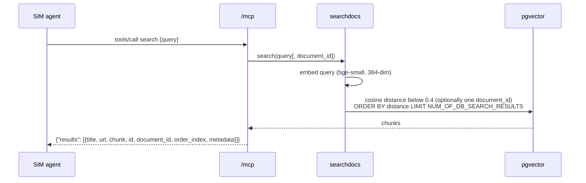

# Hopper Knowledge Base MCP — Documentation

Hopper Knowledge Base MCP ("HopperMCP") is the knowledge base behind [Hopper](https://github.com/diging/hopper). It ingests websites, HTML pages and PDFs, splits them into chunks, embeds each chunk as a vector and stores everything in PostgreSQL with the pgvector extension. 

It then exposes semantic search over those chunks as [MCP](https://modelcontextprotocol.io/) tools so an AI agent can use the knowledge base for retrieval-augmented generation (RAG).

It serves two kinds of clients:

- **Hopper** (the Django web app) manages the contents of the knowledge base through the HTTP document API mounted at `/docs`. It adds, updates, lists and deletes documents.
- **The AI agent** (a SIM workflow) queries the knowledge base through the MCP server mounted at `/mcp`. It calls the `search` and `get_document_chunks` tools while answering a user's question.

The full API reference is in [ENDPOINTS.md](ENDPOINTS.md).

---

## Contents

1. [Architecture](#architecture)
2. [Code map](#code-map)
3. [Data model](#data-model)
4. [Workflows](#workflows)
5. [Authentication](#authentication)
6. [Endpoints](#endpoints)
7. [Configuration](#configuration)
8. [Running the server with Docker](#running-the-server-with-docker)

---

## Architecture

### Place in the Hopper platform



### Inside the server

A single Starlette application (`server.py`) mounts two FastMCP instances:

| Mount | FastMCP instance | Purpose | Auth |
|---|---|---|---|
| `/mcp` | `mcp_server` (`mcp_server.py`) | MCP protocol endpoint (streamable HTTP, JSON responses) exposing tools and a resource | FastMCP `JWTVerifier` on every MCP request |
| `/docs` | `documents_server` (`documents_server.py`) | Plain HTTP routes, registered with `custom_route`, for document management | `@require_api_key` decorator on every route |

The app runs under Uvicorn on `0.0.0.0:$MCP_PORT` (default `8000` inside the container, published as `$WEB_PORT`, default `8002`, on the host). The Starlette app uses the MCP app's lifespan so the FastMCP session manager starts and stops with the server.


## Code map

| File | Responsibility |
|---|---|
| `server.py` | Entry point. Builds the Starlette app, mounts `/mcp` and `/docs` and starts Uvicorn. |
| `mcp_server.py` | MCP tools (`search`, `datetime`, `get_document_chunks`) and the `hopper://documents/{id}` resource. Configures JWT auth for `/mcp`. |
| `documents_server.py` | `/docs` HTTP routes: list, add website, add PDF, update PDF, add HTML, download file, delete. Also serializes responses (`_create_document_json`). |
| `decorators.py` | `require_api_key`: reads the `Authorization: Bearer <jwt>` header and verifies the token with the same `JWTVerifier` settings as `/mcp`. |
| `website_docs.py` | Fetches a URL (or takes uploaded HTML), extracts the `<title>`, partitions the content and **creates or updates** the document by URL. |
| `pdf_docs.py` | Saves an uploaded PDF to `DATA_DIR/pdfs/`, partitions it and creates a new document or updates an existing one by id. |
| `documents.py` | Shared pipeline: chunking, cleaning, embedding, building `Document`/`DocumentChunk` objects and list serialization. Thin wrappers over `dbconnect`. |
| `searchdocs.py` | Embeds a query and calls `dbconnect.search_documents`. |
| `dbconnect.py` | SQLAlchemy engine, schema bootstrap, CRUD and the pgvector similarity query. |
| `dbmodel.py` | SQLAlchemy models `Document` and `DocumentChunk` plus the `DocumentTypes` enum. |
| `documents/DOC1.html`, `DOC2.html` | Static sample pages served by the proof-of-concept `hopper://documents/{id}` resource. Not part of the knowledge base. |
| `docker/startup.sh` | Container entry point: sources `.app_env` and runs `uv run server.py`. |

---

## Data model

The schema is defined in `dbmodel.py` and created at import time by `dbconnect.py`.

### `documents`

| Column | Type | Notes |
|---|---|---|
| `id` | integer PK | The **document id** (`doc_id`) that Hopper stores as `mcp_kb_document_id` |
| `title` | string | For websites and HTML, taken from the page's `<title>` (`"No Title Found"` if missing). For PDFs, supplied by the caller. |
| `url` | string, nullable | Source URL. **Unique key for websites and HTML** (used to detect re-ingestion). Usually empty for PDFs, because Hopper doesn't send one. |
| `local_path` | string, nullable | Path of the stored original file (PDFs only) |
| `doc_type` | string | `website` or `pdf` (the enum also defines `doc` and `csv`, which aren't used yet) |
| `metadata_json` | JSON(B), nullable | Opaque metadata from the caller. Hopper sends `date_published`, `document_type`, `publisher`, `document_author_institution` and `institution_type`. |
| `created_at`, `modified_at` | timestamptz | `modified_at` is updated on re-ingestion |

### `chunks`

| Column | Type | Notes |
|---|---|---|
| `id` | integer PK | |
| `document_id` | FK → `documents.id` | ORM relationship uses `cascade="all, delete-orphan"` |
| `order_index` | integer | Position of the chunk within the document, starting at 0 |
| `content` | text | Cleaned chunk text |
| `content_vector` | `vector(384)` | Embedding from `BAAI/bge-small-en-v1.5` |
| `metadata_json` | JSON | `{"source": <url>, "type": <unstructured element category>, "page_number": <int>}`. `page_number` defaults to `1` when unstructured doesn't report a page (always the case for websites). |

A chunk's public id is `"<document_id>-<order_index>"`, for example `"12-3"`. The agent sometimes returns this string where Hopper expects a document id, and Hopper normalizes it back to `12`.

---

## Workflows

### 1. Adding a website (`POST /docs/website/add?url=...`)



- Re-ingesting the same URL **updates the existing document in place**. The document id stays the same and the chunks are replaced. Metadata is replaced only if the new request includes it.
- The fetch does **not follow redirects**, and any non-200 response fails the ingestion. Use the final URL of a page. Sites that block bots also fail.
- Ingestion runs synchronously in the request, so a large page can take a while. Hopper calls this from a background thread with a timeout of `KB_MCP_TIMEOUT` (30 seconds by default).

### 2. Adding an HTML file (`POST /docs/html/add`)

Same as a website, except the HTML comes in as an uploaded file together with the `url` it belongs to, so nothing is fetched. This is useful for pages the server can't download itself. The URL is still the de-duplication key.

### 3. Adding a PDF (`POST /docs/pdf/add`)



- **Every call creates a new document.** PDFs aren't de-duplicated on this side. Hopper avoids duplicates itself, by skipping ZIP rows it has already imported and by calling `/docs/pdf/update` when a resource is already linked.
- Partitioning a large PDF is slow, often minutes. Hopper uses a long timeout (`KB_MCP_PDF_TIMEOUT`, 300 seconds by default) and treats a timeout as "still processing" rather than as a failure.

### 4. Updating a PDF (`POST /docs/pdf/update`)

The request looks up the document by `doc_id` (404 if missing), saves the new file, re-partitions it and replaces all its chunks, keeping the same document id. The previous file stays on disk; only `local_path` is repointed.

### 5. Searching (MCP tools `search` and `get_document_chunks`)



- **Relevance threshold:** cosine distance must be below **0.4**, where 0 means identical and 1 means unrelated. It's hard-coded in `dbconnect.search_documents`. Anything less similar is dropped, so a query can legitimately return `[]`.
- **Result count:** at most `NUM_OF_DB_SEARCH_RESULTS` chunks (default **20**), closest first.
- `get_document_chunks(id, query)` runs the same search restricted to a single document. The agent uses it to find the most relevant passages and page numbers inside a document it has already identified. Hopper shows those as "Relevant pages".
- Each result carries the chunk's `metadata.page_number`, so the agent can cite pages.

### 6. Listing documents (`GET /docs/list`)

Returns documents ordered by id and paginated with `page` / `page_size`, together with the total count. By default each document includes all its chunks (content and metadata); pass `return_chunks=false` to omit them. Hopper's "Compare with Knowledge Base" feature pages through this endpoint 50 documents at a time.

### 7. Downloading the original file (`GET /docs/{doc_id}/file`)

Streams the stored PDF. Returns 404 `{"error": "file_unavailable"}` when the document isn't a PDF or its file is missing, for example documents ingested before `local_path` existed. Hopper uses this when it starts tracking a PDF that exists only in the knowledge base.

### 8. Deleting a document (`DELETE /docs/{doc_id}`)

Deletes the document row, its chunks and the stored file, if any. If the file can't be removed, the database delete still stands and the endpoint returns 404, because `delete_document` returns `False`. That's a known quirk.

---

## Authentication

Both mounts require a **JWT bearer token**:

```
Authorization: Bearer <jwt>
```

Tokens are verified with FastMCP's `JWTVerifier`, configured from environment variables:

| Variable | Meaning |
|---|---|
| `JWKS_ENDPOINT` | URL of the issuer's public keys. With Hopper as the issuer this is `http(s)://<hopper-host>/<APP_ROOT>.well-known/jwks.json`. |
| `ISSUER_URL` | Must equal the `iss` claim in the tokens |
| `JWT_ALGORITHM` | Default `RS256` |

**Where tokens come from:** Hopper runs an OpenID Connect identity provider (django-allauth `idp.oidc`). To get a token:

1. In Hopper's admin, go to **OpenID Connect IdP → Clients → Add**, give the client a name and set **Grant types** to `client_credentials`. The client secret is shown **only once**, right after saving, so copy it then.

2. Request a token:

   ```bash
   curl -X POST https://<hopper-host>/<APP_ROOT>identity/o/api/token \
        -d grant_type=client_credentials \
        -d client_id=<client id> \
        -d client_secret=<client secret>
   ```

3. Use the returned `access_token` as the bearer token. Hopper issues tokens valid for 10 years (`IDP_OIDC_ACCESS_TOKEN_EXPIRES_IN`), so this is effectively a long-lived service credential. Hopper stores it in `KB_MCP_JWT_TOKEN`, and the SIM agent needs one too, configured in SIM, to call `/mcp`.

Failure responses:
- `/docs/*` returns **403** `{"error": "Forbidden"}` when the header is missing or the token is invalid.
- `/mcp` returns FastMCP's standard **401** response.

---

## Endpoints

The complete reference, with parameters, request examples and response shapes, is in **[ENDPOINTS.md](ENDPOINTS.md)**. In summary:

| | Endpoint | Purpose |
|---|---|---|
| Document API | `GET /docs/list` | Paginated documents, optionally with chunks |
| | `POST /docs/website/add` | Fetch and ingest a URL (create or update by URL) |
| | `POST /docs/html/add` | Ingest an uploaded HTML file for a URL |
| | `POST /docs/pdf/add` | Ingest an uploaded PDF (always creates a new document) |
| | `POST /docs/pdf/update` | Replace an existing PDF document by id |
| | `GET /docs/{doc_id}/file` | Download the stored PDF |
| | `DELETE /docs/{doc_id}` | Delete a document, its chunks and its file |
| MCP (`/mcp`) | tool `search(query)` | Semantic search across all documents |
| | tool `get_document_chunks(id, query)` | Semantic search within one document |
| | tool `datetime()` | Current server date and time (ISO 8601) |
| | resource `hopper://documents/{id}` | Proof-of-concept sample pages |

---

## Configuration

Configuration is split across three files, each created from its `*-example` template. None of them are committed.

| File | Used by | Variables |
|---|---|---|
| `.env` | Docker Compose variable substitution | `WEB_PORT`: host port for the server (default `8002`). `DB_PORT`: only relevant if you un-comment the DB port mapping. |
| `.docker-env` | Both containers (`env_file`) | `POSTGRES_DB`, `POSTGRES_USER`, `POSTGRES_PASSWORD`, `POSTGRES_HOST` (`db`), `POSTGRES_PORT` (`5432`). The Postgres container and the app both read these. |
| `.app_env` | Sourced by `docker/startup.sh` | See below |

`.app_env` variables:

| Variable | Default | Purpose |
|---|---|---|
| `MCP_PORT` | `8000` | Port Uvicorn listens on inside the container |
| `DATA_DIR` | `./data` | Where uploaded PDFs are stored (`$DATA_DIR/pdfs/`). With the default bind mount this is `./data/pdfs` in the repo. |
| `ISSUER_URL` | `http://localhost:8000` | Expected JWT issuer |
| `JWKS_ENDPOINT` | *(empty)* | JWKS URL used to verify JWTs (required) |
| `JWT_ALGORITHM` | `RS256` | JWT signing algorithm |
| `NUM_OF_DB_SEARCH_RESULTS` | `20` | Maximum chunks returned per search |
| `RESOURCE_SERVER_URL`, `REQUIRED_SCOPES` | — | In the example file but **not read by the code** at the moment |

---

## Running the server with Docker

```bash
cp .app_env_example .app_env         # then set JWKS_ENDPOINT / ISSUER_URL
cp .docker-env-example .docker-env   # set a real POSTGRES_PASSWORD
cp .env-example .env
mkdir -p postgres_data
docker compose up
```

- `web` builds from `Dockerfile` (Python 3.12, uv, and the system libraries unstructured needs for PDFs), bind-mounts the repo to `/usr/src/app` and publishes `${WEB_PORT}` → `8000`.
- On first start, uv installs dependencies and fastembed downloads the embedding model. Both need internet access and take a while.
- When Hopper runs in its own Compose stack on the same machine, it reaches this server at `http://host.docker.internal:8002`. This server reaches Hopper's JWKS at `http://host.docker.internal:8000/...`.


### Logging

The code uses `print()`, so output appears in `docker compose logs web`.

